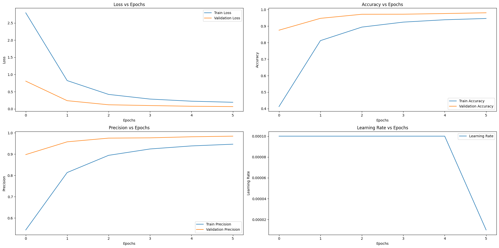

# fruits_recognition

This repository contains code for a Telegram bot that classifies images of fruits. The bot uses a pre-trained custom ShuffleNet model to perform image classification. Users can send an image to the bot, and it will respond with the predicted class of the fruit in the image.

## Table of Contents
- [Installation](#installation)
- [Usage](#usage)
- [Training the Model](#training-the-model)
- [Bot Setup](#bot-setup)
- [Training Results](#training-results)
- [License](#license)

## Installation

1. **Clone the Repository**
   ```bash
   git clone https://github.com/yourusername/fruits_dataset.git
   cd fruits_dataset
2. **Install Required Packages**
   ```bash
   pip install clearml rembg efficientnet_pytorch torchmetrics telebot tqdm
3. **Set Up Environment Variables**
   ```bash
   export CLEARML_WEB_HOST=https://app.clear.ml
   export CLEARML_API_HOST=https://api.clear.ml
   export CLEARML_FILES_HOST=https://files.clear.ml
   export CLEARML_API_ACCESS_KEY=YOUR_ACCESS_KEY
   export CLEARML_API_SECRET_KEY=YOUR_SECRET_KEY
## Usage

## Training the Model

1. **Prepare the Dataset**
   ```bash
   git clone https://github.com/ardipazij/fruits_dataset.git
   rm -r fruits_dataset/.git
   ```
   Ensure your dataset directory structure is as follows:
   ```
   fruits_dataset
   ├── Training
   └── Test
   ```
2. **Mount Google Drive**
   ```python
   from google.colab import drive
   drive.mount('/content/drive')

3. **Ensure you have a directory on Google Drive:**
   ```
    collab
    ├── fruits
    │   └── logs
   ```
4. **Train the Model**
    Follow the training script provided in model_with_clearml.ipynb to train the ShuffleNet model on your dataset.

## Bot Setup

1. **Create a Telegram Bot**
        Talk to @BotFather to create a new bot and get the API token.

2. **Set Up the Bot**
    Configure the bot by editing bot.py with your bot token and model path. Run bot.py to start the bot.

## Training Results

The training process includes several key metrics that were tracked and plotted for analysis. Below are the graphs for loss, accuracy, precision, and learning rate over the epochs.


